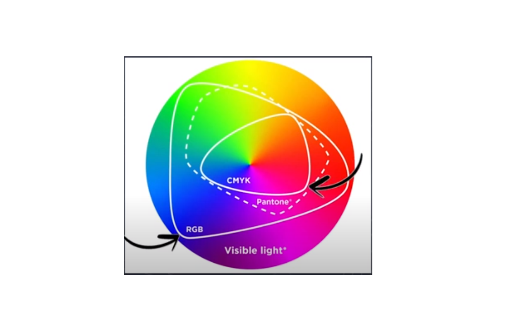
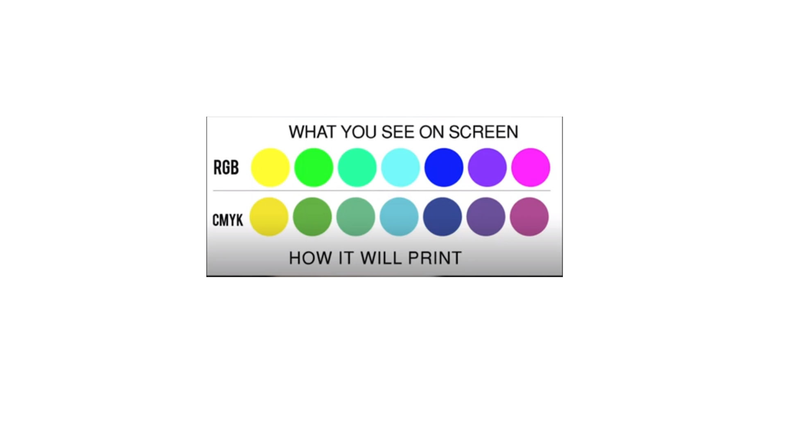

# Bài 4: RGB và CMYK

Hai này là 2 hệ màu chính trong thiết kế

RGB: red green blue

CMYK: Cyan Magenta Yellow Black

Black dùng chữ K vì Blue đã dùng chữ B rồi.

**Ghi nhớ:**

Trái ngược red là cyan
Trái ngược green là magenta
Trái ngược blue là yellow

Nó liên quan tới chỉnh màu

Chú ý: Trong thiết kế tránh dùng từ tiếng việt để miêu tả màu sắc.

Tiếng việt không đủ vốn từ mô tả màu sắc

Khi thiết kế nên nói chuyện bằng mã màu HEX

- Hãy xin khác hàng mã màu Hex họ muốn thiết kế
- Hoặc cũng cho ta thấy hình ảnh qua màu sắc đó.
- Tuyệt đối không nói miệng
---
RGB: Hệ màu **Addictive** (hệ màu cộng)

Red - Green - Blue

Kết hợp Red + Blue = Magenta (màu hồng)
Kết hợp Green + Blue = Cyan (màu hồng)
Kết hợp Red + Green =  Yellow (vàng)

Để ý thấy 3 cái màu sau khi kết hợp nó sáng hơn những màu chính

Red + Green + Blue = White (màu trắng)

---
CMYK: Hệ màu **Subtractive** (hệ màu trừ)

Kết hợp 3 màu Cyan + Magenta + Yellow = Black

Cyan + Magenta = Blue
Cyan + Yellow = Green
Magenta + Yellow = Red

Để ý thấy 3 cái màu sau khi kết hợp nó cho màu tối hơn những mảng màu chính.

Lý do gọi hệ màu này là hệ màu trừ, vì nó không tự phát ra ánh sáng được.

Các hệ màu này phải đi hấp thụ ánh sáng hoặc phản xạ ánh sáng. Để tạo ra ánh sáng.

Trong in ấn thường hệ màu CMYK chính vì vậy họ dùng giấy trắng.

---
Tóm lại: 

Hệ màu RGB thường sử dụng để thiết kế để hiển thị lên màn hình máy tính điện thoại.

Hệ màu CMYK thường sử dụng để in ấn.

---

không gian màu:

Theo hình ảnh cung cấp, không gian màu của màu RGB lớn hơn CMYK rất là nhiều.

Đầu tiên phải xác định thiết kế dùng để làm gì? "In ấn" hay "thiết kế cho các màn hình kỹ thuật số".

Nếu thiết kế cho in ấn CMYK - dùng RGB đi in thì sẽ bị sai màu.

Nếu thiết kế cho thiết bị điện tử RGB

Chọn màu trong Photoshop nếu hiên thị dấu chấm than ở phần màu này gọi là Out of Gamut, màu này nằm ngoài cái gam màu cho phép.

Nếu đi in set sẵn luôn màu CMYK tránh các trường hợp in sai màu

Cách đổi hệ màu trong Photoshop, lên thanh điều khiển - thanh công cụ, chọn Image -> chọn Mode -> chọn RGB hoặc CMYK là tùy mọi người.

Mã màu Hex thì nó thuộc mã màu RGB - Nên khi in ấn tránh dùng mã màu Hex 

Hex có mã #RRGGBB

trắng #FFFFFF
đen #000000

CMYK hiển thị từ 0 - 100%

---

Tổng kết: 

Trong thiết kế 2 hệ màu chính RGB và CMYK

- **RGB** là **hệ màu cộng**, dùng cho những thiết kế hiển thị trên màn hình điện tử và thiết kế web.

- Còn **CMYK** là **hệ màu trừ**, chỉ sử dụng cho các thiết kế được in ấn.

Không gian màu của RGB lớn hơn rất nhiều CMYK

Để sử dụng hệ màu thì đầu tiên cần phải xác định được mục đích của thiết kế là gì để tránh trường hợp khi in bị sai lệch màu 

