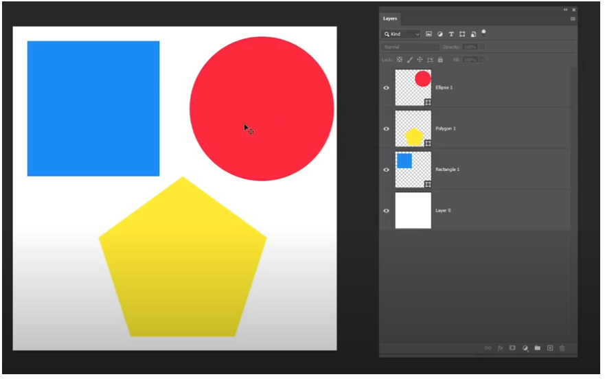

# Bài 10: Layer

Bài này 1 trong những bài quan trọng.

Layer Từng các lớp đặt đè lên nhau

Bảng Layer giúp sắp xếp các tầng hiệu ứng để tạo thành các hình ảnh hoàn thiện nhất có thể

Thí dụ trên canvas của mình, hãy tưởng tượng có 3 hình 1 hình vuông 1 hình tròn và 1 hình đa giác.

Layer hình tròn nằm trên cùng đè lên layer hình vuông

Layer hình đa giác nằm đè lên layer hình vuông 

Layer hình vuông nằm đè lên canvas 

Layer canvas nằm vị trí cuối cùng

Tóm lại các Layer nào nằm bên trên thì nó sẽ đè được các Layer nằm bên dưới

---

Vị trí các layer được thể hiện bảng bên cạnh, chúng ta có kể thay đổi vị trí layer bằng cách kéo thả.

Chúng ta có thể nhóm các layer lại với nhau. Ctrl+G

Chúng ta có thể phá các nhóm ra bằng cách. Ctrl+shift+G

---
Các chức năng này nằm cuối bên tay phải

Biểu tượng "fx" - Add a layer style: Cho chúng ta thêm các hiệu ứng lên. Ví dụ:

Outer Glow: thêm bóng xung quanh,...

Biểu tượng "Layer mask" - Add layer mask: Thêm mặt nạ

Biểu tượng "adjustment layer": Thêm màu sắc, chỉnh sáng tối cho layer của bức hình đó

Biểu tượng tạo "New Group" - Create a new group Tạo ra một nhóm mới.

Biểu tượng "create a new layer" - Tạo ra một layer mới, Ví dụ mình muốn vẽ lên nét nào đó cho hình, mình nên tạo ra layer mới đè lên hình đó xong mình vẽ, lúc xóa hay chỉnh sửa nó sẽ không ảnh hưởng đến phần hình

Biểu tượng "Thùng rác": xóa.

---
Các chức năng này nằm trên nơi chứa các Layer

Chức năng bao gồm: lock, fill

Chức năng lock: 5 biểu tượng khác nhau

Bên trong chức năng lock có nhiều thuộc tính con:
- Lock transparent pixel: khi kích hoạt các phần không thuộc hình "caro trắng đen" là các pixel không hiển thị sẽ không bị tác động, lúc này chỉ có thể tác động lên được hình thôi.

- Lock image pixel: khi kích hoạt mình sẽ lock cái hình lại, không thể tác động lên hình chẳng hạn như xóa, vẽ,... Nhung mà vẫn di chuyển được nha.

- Lock position: khóa vị trí không di chuyển được luôn

- Lock add bar: khóa add bar khi ảnh ra ngoài thì biến mất

- Lock all: khóa hết

Giới thiệu 

Add bar: Nếu như thông thường 1 canvas thì ta chỉ có thể làm việc trên chính canvas đó muốn thêm cái 2 thì không được. Nhưng add bar có thể thêm nhiều cái, nó giống như tờ giấy, muốn thêm bao nhiêu tờ cũng được.

Các hình ảnh nằm trong add bar thì mới hiển thị lên hình ảnh final, còn các ảnh nằm ngoài add bar sẽ không hiển thị ở hình ảnh final.

---
Tổng kết:

Định nghĩa về Layer

Cách hoạt động cơ bản của layer trong PTS

Những chức năng/Thuộc tính trong bảng Layer của PTS