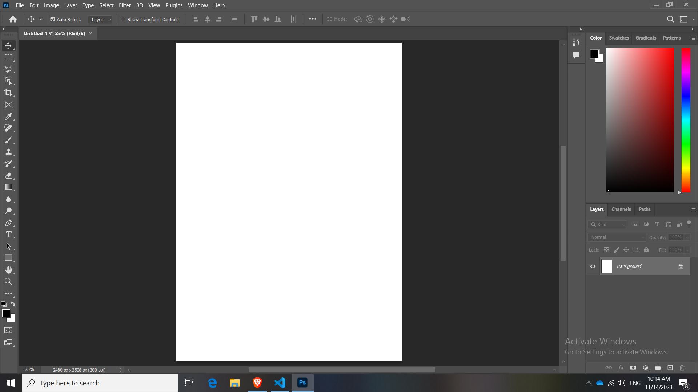
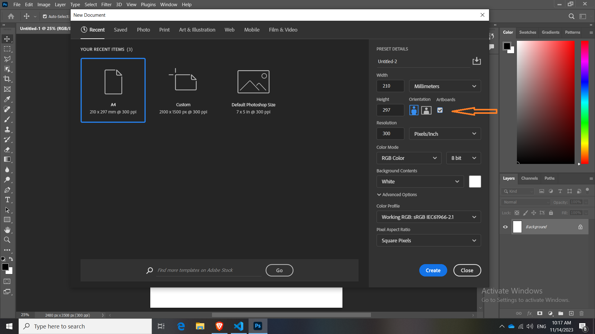
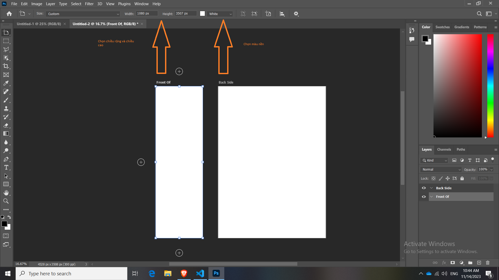

# Bài 17 Công Cụ ArtBoard

Nội dung chính:

- Tìm hiểu ArtBoard là gì? Lợi ích sử dụng nó

- Cách thức sử dụng nó và các phím tắt

- Cách xuất ArtBoard sao cho đúng

## Tìm hiểu ArtBoard là gì? Lợi ích sử dụng nó

prosure: cái quảng cáo nhỏ nhỏ, gắp gọn lại được 2 - 3 lần

Search google "prosure" để dễ hình dung hơn.

Để tạo ra 1 cái prosure như sau:

- Tính chất prosure thường là HCN, và chiều dọc nhấn create
- Nếu tạo bình thường như vậy trong document chỉ còn 1 Canvas. Mà thường thường prosure thì thường có 3-4 trang
- Vậy câu hỏi đặt ra làm sao nhiều khung Canvas xuất hiện trong 1 document nằm kế bên nhau? "Để dễ thuận tiện quản lý và đổi các thiết kế qua lại trong cùng 1 document"

- Cái ArtBoard nó rất là tiện cho thiết kế tạp chí, Card visti, hoặc những bài Post social media lên Facebook hay Instagram
- Tóm lại cái ArtBoard giúp ta tạo nhiều trang trong cùng 1 document.

- Hãy hiểu là ArtBoard giống như Canvas

## Cách thức tạo ArtBoard mới trong Document

Bạn phải tạo sẵn 1 Document 

Bạn chọn File -> New

Bạn chú ý chữ ô tick có chữ ArtBoard nằm bên tay phải, Click "tick" vào đó

Sau khi tick bấm create

So sánh:

Bạn thấy artboard đó nó giống như Canvas. Để phân biệt thì artboard nó text nhỏ nằm trên đầu

Còn sự khác biệt giữa Artboard và Canvas

- Canvas là 1 tờ giấy duy nhất. Không cho phép thêm tờ khác

- Artboard là 1 tờ giấy, cho phép chúng ta có thể tạo ra nhiều tờ giấy.

Cách để thêm Artboard trong 1 document:

- Cách 1: Chọn vào Artboard đó, sau đó chọn Move tool (Artboard tool), xuất hiện 4 dấu cộng trên dưới trái phải, chỉ cần nhấn vào dấu cộng để thêm

- Cách 2: họn vào Artboard đó, sau đó chọn Move tool. Di chuyển chuột đến cạnh, nó xuất hiện dấu cộng. "Không cần phải chọn Artboard tool"

Xóa Artboard trong 1 document:

- Nhấn vào Artboard sau đó nhấn vào nút "Backspace" trên bàn phím

Di chuyển Artboard:

- Rê chuột tới cạnh của Artboard sau đó kéo.

Thay đổi kích thước Artboard:

- Chọn Move tool thay đổi chế độ Artboard tool

- Sau đó để ý trên thanh công cụ có width height, chỉ cần thay đổi

Thay đổi nền của Artboard:

- Select vào Artboard sau đó có thể chọn màu cho background hoặc để background transparent

Cái ArtBoard giúp chúng ta có thể thêm nhiều tờ giấy vào trong 1 tab - từ đó có thể 1 tab có thể làm việc nhiều canvas

Với công cụ ArtBoard chúng ta có thể tạo ra nhiều trang trong 1 document.

## Thực hành: Tạo thiết kế Balo

Tạo ta các Artboards

Đưa ảnh vào, và ảnh đó sẽ được "Smart Object" sẵn

Nhấp Ctrl T để chỉnh sửa được chiều rộng và chiều cao của ảnh.

Nhấn giữ "Alt" Kéo cạnh của ảnh để ảnh co giản đều chiều rộng và chiều cao

## Sắp xếp các Artboards

Giữ Ctrl nhấn chọn hết các Artboards sau đó nhìn thanh công cụ để căn chỉnh ảnh 

## Hình ảnh trong Artboards

Hình ảnh không nằm trong khu vực của Artboards khi xuất ra nó sẽ không hiện

## Cách xuất các Artboards thành từng File riêng

Bước 1: Chọn Artboards

Bước 2: Nhấn vào File

Bước 3: Chọn Export

Bước 4: Artboards to File (Lúc này sẽ hiển thị bảng Artboards to Files)

Bước 5: Nhìn vào trong popup sẽ Thấy dòng đầu tiên là Destination (đây sẽ là nới lưu file Artboards mà ta sẽ xuất ra)

Bước 6: Đặt cái File names đặt tên cho file

Bước 7: Cần lưu ý là file xuất ra nên là file gì? Để ý dòng File Type

ArtBoard cũng có thể hiểu là canvas - khung tờ giấy

Muốn thêm nhiều ArtBoard trong 1 tab:

File - New - click vào Artboards

Tạo file thành công trên đầu trang giấy sẽ có **Artbard 1**

