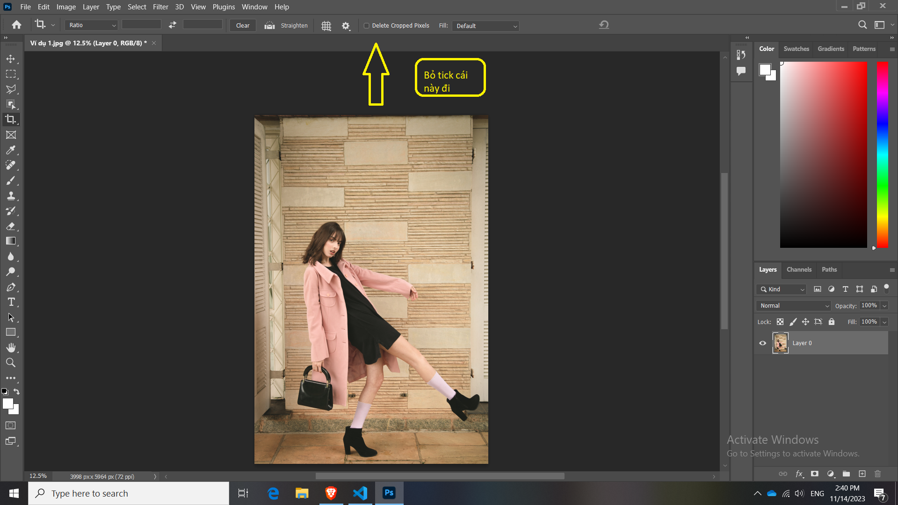
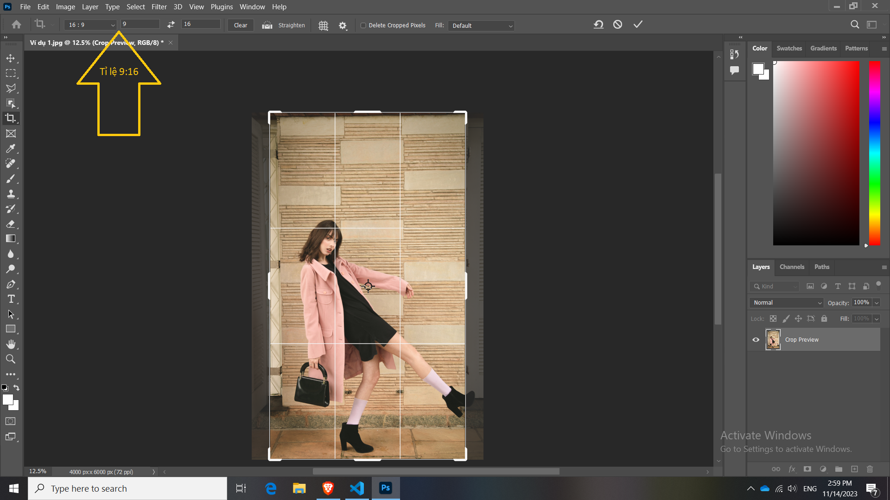
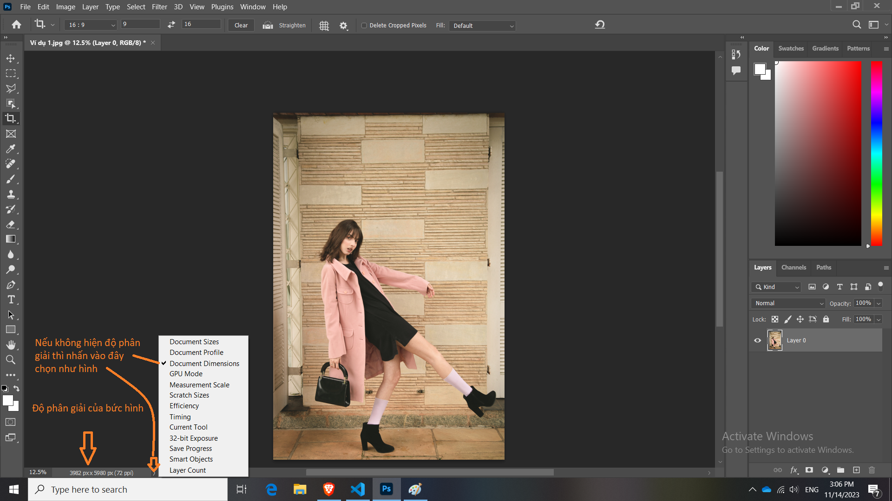
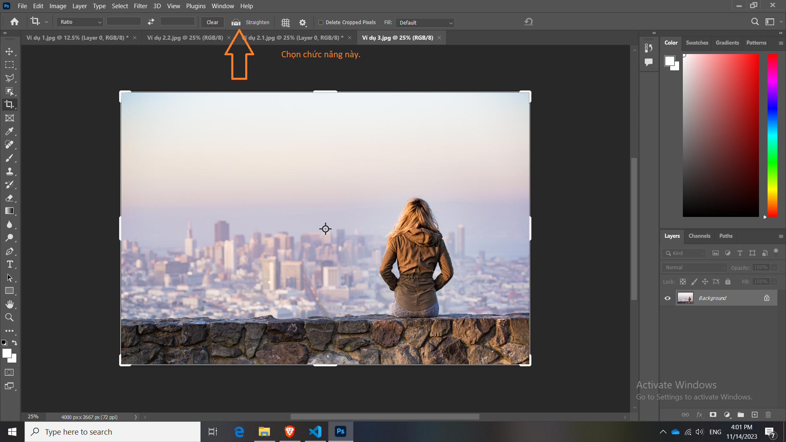
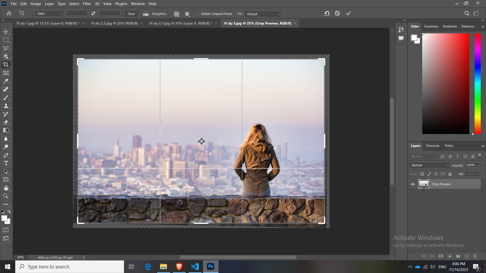
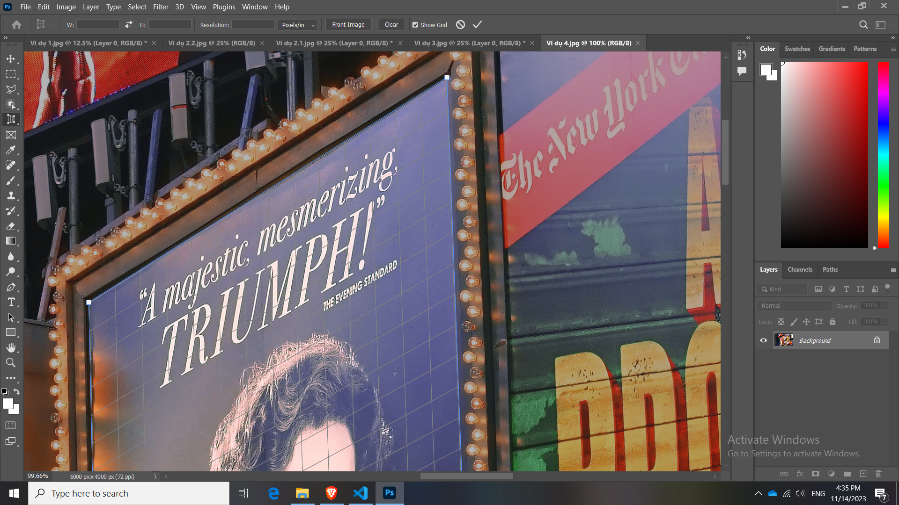
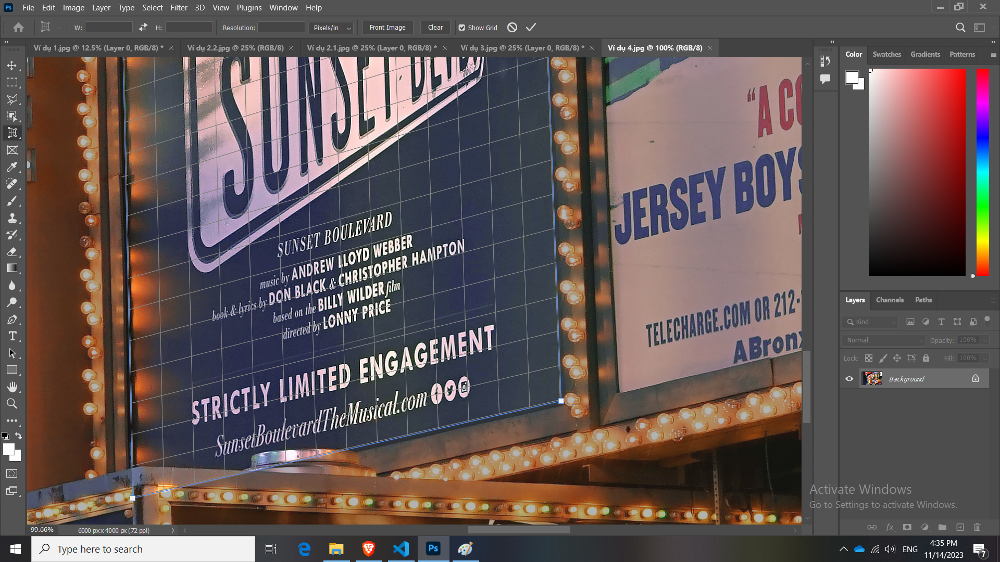
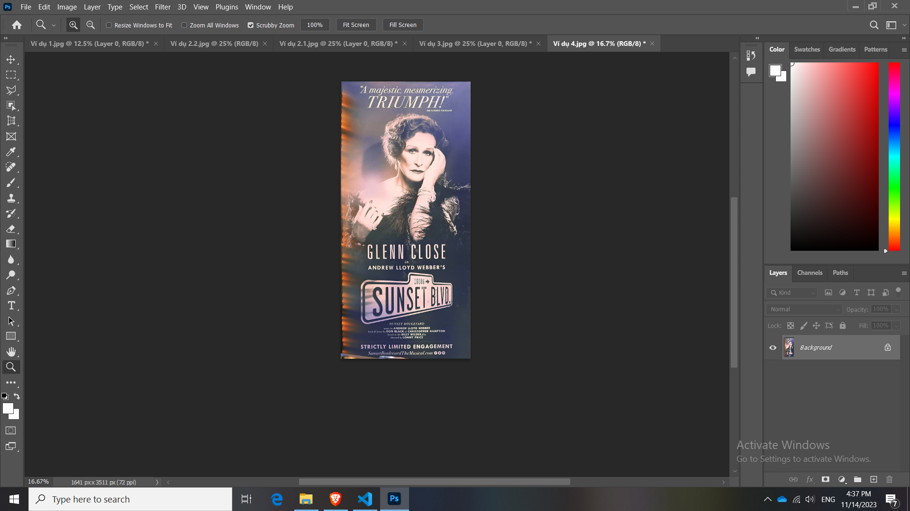

# Bài 18 Crop hình đúng cách

## Phím tắt crop hình ảnh:

Crop tool: **C**

Quy trình:

Bước 1: Chọn hình và xác định vị trí sẽ Crop

Bước 2: Nhấn phím C hoặc chọn Crop tool

Bước 3: Canh khung hình cần Crop vào trong khung

Bước 4: Sau khi vừa ý thì nhấn Enter. Chấp nhận sự thay đổi này

## Một vài lưu ý

Nên chọn phong cách chỉnh ảnh non-destructive (không phá hủy)

Loại bỏ tính năng **Delete Cropped Pixels**. Bằng cách bỏ tích ở trên thanh công cụ.

Để ảnh về bình thường thì chọn Ratio nhấn nút mũi tên xoay ngược, để về lại vị trí ban đầu

## Crop hình theo tỷ lệ

Bước 1: Chọn hình và xác định vị trí sẽ Crop

Bước 2: Nhấn phím C hoặc chọn Crop tool

Bước 3: Nhìn lên thanh công cụ, ví dụ tỉ lệ 9:16 đi Nhập vào 2 ô lần lượt là 9 và 16 "ngang 9 dọc 16" còn 16:9 "ngang 16 dọc 9"

Bước 4: di chuyển đến vị trí cắt, thấy ưng bấm enter

Ngoài ra muốn hủy tỷ lệ có nút Clear

Cách xem độ phân giải và hiển thị độ phân giải 

## Làm ảnh theo tỷ lệ

Ví dụ ảnh bìa Facebook (820px x 312px)

Bước 1: Chọn ảnh

Bước 2: Nhấn C

Bước 3: Nhìn lên thanh công cụ that vì chọn **Ratio** thì mình chọn **W x H x Resolution**

Bước 4: Sau khi chọn xong nhập kích thước vào ví dụ 820px x 312px

Bước 5: Di chuyển ảnh đến vị trí cắt

## Làm một ảnh dựa trên khung ảnh khác

Bước 1: chọn ảnh lấy ra làm mẫu để ảnh 2 tuân theo, nhấn C

Bước 2: chọn Front Image để khung Crop để lấy toàn ảnh

Bước 3: qua ảnh thử 2 vẫn để chế độ Crop, di chuyển bằng nút lên xuống hoặc nắm kéo các khung kéo lên xuống

## Xử lý các bức hình bị nghiêng

Bước 1: Chọn ảnh cần chỉnh, nhấn phím C

Bước 2: Chọn Straighten

Bước 3: Kéo theo độ nghiêng của ảnh. (nhấn giữ chuột trái tại điểm nghiêng di chuyển đến điểm không nghiên và buông chuột)

Điểm hạn chế của cách này làm mất một vài phân đoạn trong bức ảnh

Vậy có cách nào để không làm mất hình không. Có cách sau 

AI PS nó tự vẽ thêm

Làm tương tự 3 bước trên

Sau đó chọn fill xổ xuống chọn Content-Aware Fill để lắp đầy các khoảng trống

Bước 4: Kéo phần Crop mở rộng ra để lắp đầy khoảng trắng

Bước 5 thấy hợp rồi thì Nhấn enter

## Công cụ thứ 2 muốn giới thiệu là **Perspective Crop Tool**

Perspective Crop Tool là gì? Công dụng nó làm được gì

Chuyển góc nhìn của ảnh nằm nằm nghiên thành ảnh 2D giống thẳng đến mắt người dùng

Nhấn Enter để hiển thị ảnh 2D trên 1 mặt phẳng

Trong trường hợp thấy không thích tỉ lệ của ảnh thì ta nhấn tổ hợp phím ctrl + T, sau đó giữ shift kéo thả khung cho ảnh chuyển về tỷ lệ mà mình mong muốn

Sau đó dùng Crop tool để cắt đi cái phần thừa.

Nhấn OK

## Tổng kết:

1. Crop hình đúng cách

2. Tùy chọn tỷ lệ, độ phân giải khi Crop
 
3. Cách làm cho 2 tỷ lệ có cùng độ phân giải

4. Cách làm thẳng lại hình bị nghiêng / Dùng Content Aware để không làm biến mất chi tiết

5. Cách sử dụng công cụ Perspective crop tools

