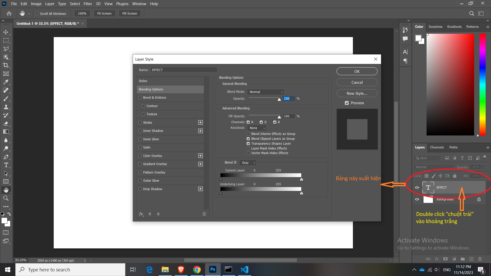
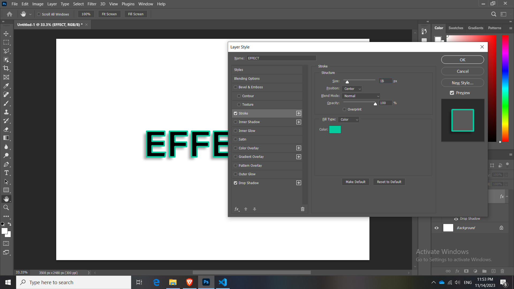
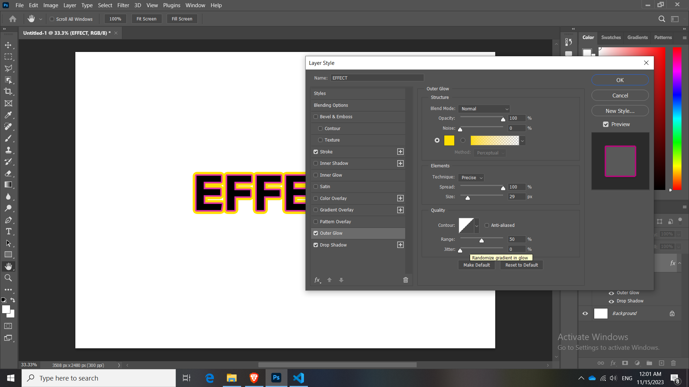

# Bài 19.2: Table Layer Style

**Text**

Có 2 cách để mở bảng Layer Style của Text

Cách 1:

- Chọn Text - nhấn fx - show ra 10 cái effect - chọn bất kỳ thì nó sẽ show ra Layer Style

Cách 2: 

- Nhấn vào double click chuột trái vào bên phải của phần thumbnail layer

## Hiêu ứng Drop shadow

Những thông số của Drop shadow:

- Blend Mode
- Color: Chọn màu cho cái bóng
- Opacity: độ hiển thị của nó, số càng lớn thì càng đậm, số càng nhỏ thì mờ
- Angle: góc độ để bóng, ban đầu để 90 độ, vuông góc
- Distance: khoảng cách của bóng đến chữ, càng lớn càng xa
- Spread: số càng lớn dài và cứng
- Size: càng nhỏ thì càng đậm, càng lớn thì càng nhòe

- Ngoài ra ta có thể nắm kéo di chuyển cái bóng trên canvas

**Lưu ý:** Phải unlock cái khóa mới thao tác được

## Hiêu ứng Stroke

Đường viền của chữ

- Size: điều chỉnh độ dày của đường viền

- Position: chúng ta muốn viền đó nằm bên ngoài hay bên trong hoặc giữa

- Opacity: Độ mờ

## Hiều ứng Outer Glow:
 
Tỏa sáng

hiệu ứng ánh sáng được áp dụng vào viền bề ngoài của một đối tượng trong hình ảnh. Khi bạn thêm hiệu ứng Outer Glow vào một layer, nó tạo ra một lớp ánh sáng mờ xung quanh đối tượng, tạo cảm giác đối tượng đó đang phát sáng hoặc có một loại sáng tạo từ bề ngoài.

