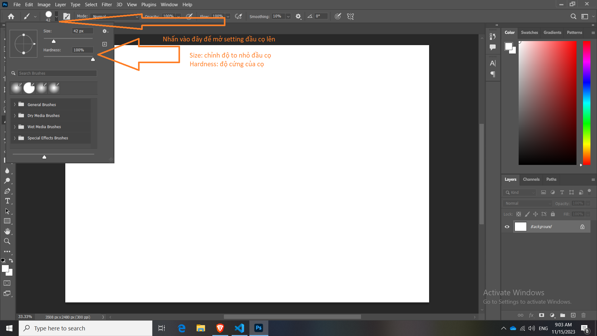
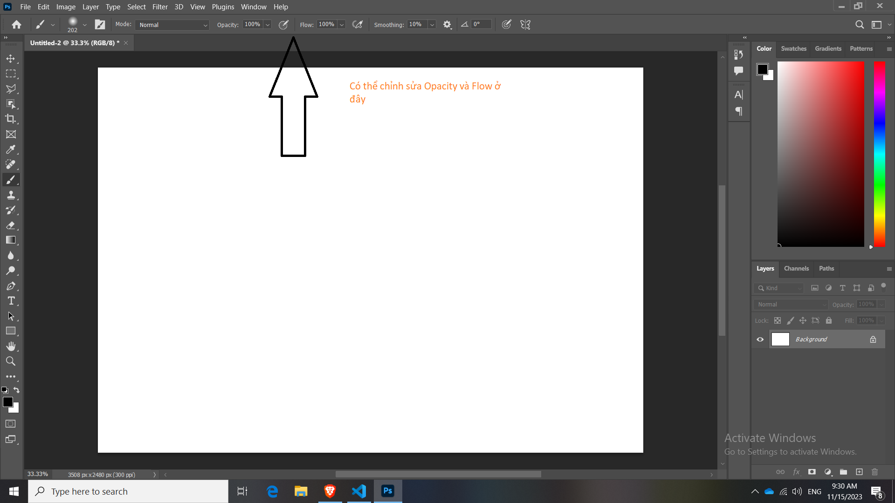

# 20 Công cụ Brush

Công cụ này không chỉ giúp chúng ta tô màu, vẽ mà còn hỗ trợ ta các công việc sử dụng Mask, Brush trắng và đen tô hiển thị và ẩn đi,... còn rất nhiều ứng dụng khác

## Bốn điều cần lưu ý khi sử dụng Brush

- Thứ 1: kích thước của đầu cọ
- Thứ 2: Hones (độ cứng của cọ, nét của cọ đó khi vẽ ra)
- Thứ 3: Opacity (độ trong suốt của màu cọ đã vẽ)
- Thứ 4: Flow (cường độ mạnh hay nhẹ chúng ta muốn cọ vẽ hiển thị như nào)

 
**Một vài lưu ý**

Từ đầu đến giờ ta đang theo đuổi 1 phong cách non-destructive

Cho nên trong bài này cũng áp dụng phong cách đó

Ta không thao tác trực tiếp lên hình, mà nên tạo ra 1 layer mới sau đó vẽ trực tiếp lên chính layer đó. Khi muốn ẩn đi cái mình vẽ sẽ rất dễ dàng

## Hướng dẫn setting công cụ Brush

## Phím nhanh để chỉnh đầu cọ

Nhấn Phím B: chuyển về chế độ đầu cọ

Combo chỉnh đầu cọ: 

Cách 1: Alt + **đè** chuột phải (Di chuột qua phải đầu cọ to lên, di chuột qua trái đầu cọ nhỏ đi)

Cách 2: **nhấn phím** "[" giảm đầu cọ **nhấn phím** "]" tăng đầu cọ

## Phím nhanh để chỉnh độ cứng của cọ

Nhấn phím B: chuyển về chế độ đầu cọ, nếu đang dùng cọ sẵn rồi thì không cần nhấn

Combo chỉnh đầu cọ: 

Như trên ta học nhấn alt + đè chuột phải di chuyển sang trái hoặc phải là để chỉnh size đầu cọ.

Giờ đây để điều chỉnh độ cứng thì ta chuyển nó "lên" Hoặc "xuống"

Alt + **đè** chuột phải (Di chuột lên thì độ cứng nó giảm đi, di chuột xuống độ cứng nó sắc hơn, đường vân sắc nét hơn)

## Tìm hiểu về Opacity và Flow

Opacity độ trong suốt cọ

Flow cũng có hiệu ứng giống giống vậy

Điều chỉnh Opacity và Flow

Vậy làm sao phân biệt giữa 2 thằng

Ví dụ: Opacity 20% Flow 100%

thì khi đang trong nét vẽ có chồng lên nhau thì màu không đổi

Nhưng khi ngắt nét đó rồi thì và vẽ đè lên thì nó nặng màu hơn

Ví dụ: Opacity 100% Flow 20%

Vẽ đè lên thì đậm lên mặt dù chưa ngắt nét

Càng tô lâu 1 vị trí càng đậm

Kết luận Opacity và Flow

