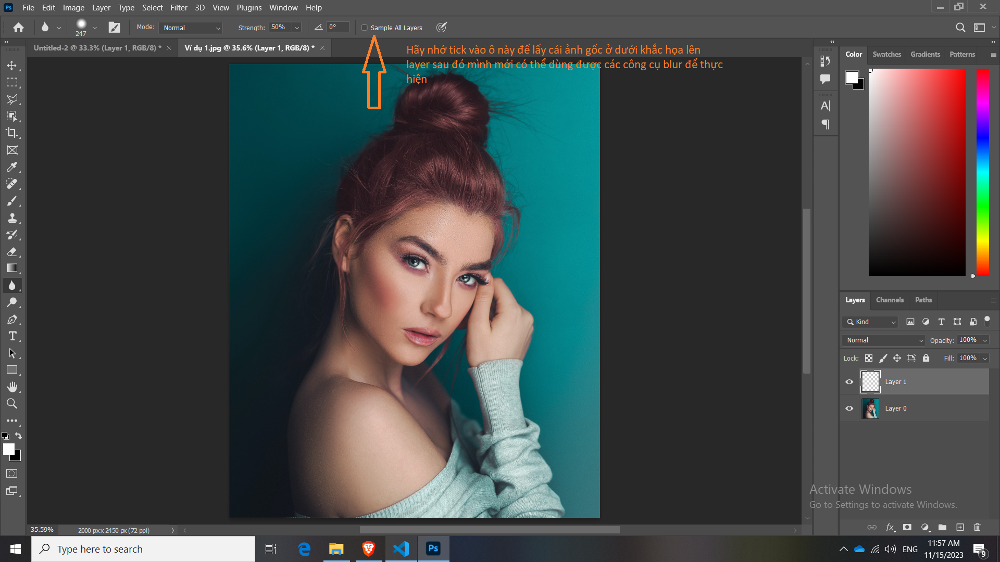
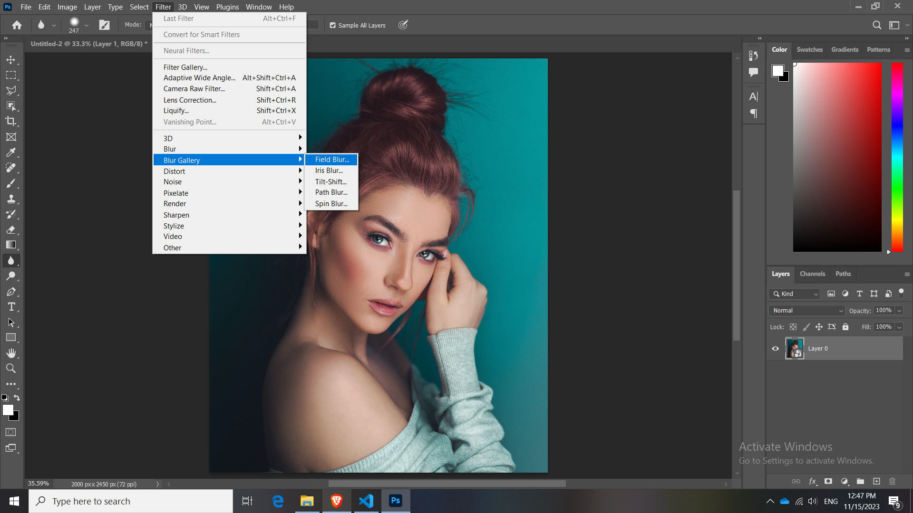
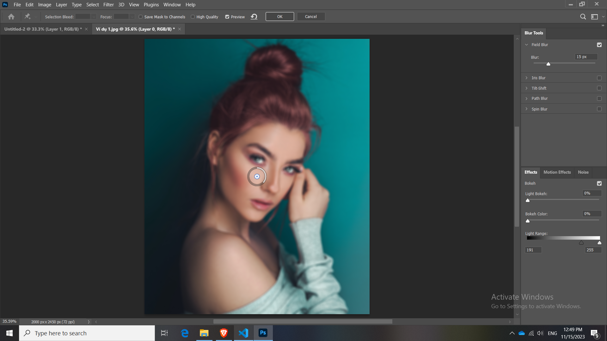

# 21 Công cụ Blur, Sharpen, Smudge

Trước khi làm bất kỳ điều gì hãy nhớ về phong cách non-destructive

Đừng thao tác trực tiếp lên ảnh gốc, mà hãy tạo layer trước sau đó hãy thao tác

Đối với công cụ blur như này thì nên tick vào ô "smaple All Layers"

## Blur: Làm mờ

- Có 2 cách để làm blur:

Một là mình dùng Blur tool công cụ photoshop, 

Hai là mình chọn ảnh gốc. Convert ảnh sang Smart Object rồi dùng Filter Gallery Blur

Đây là thành phẩm

Bạn xoay núm tròn đó càng nhỏ thì độ mờ nhỏ, xoay núm tròn càng lớn thì càng mờ.

Blur tool

Sharpen tool

Smudge tool

## Sharpen: Sắc nét

## Smudge: Làm nhòe, kéo giản

## Tổng kết bài 21

1. Hạn chế sử dụng những công cụ mặc định như Blur, Sharpen, Smudge
2. Field Blur có thể thay thế cho công cụ Blur
3. Smart Sharpen có thể thay thế cho công cụ Sharpen
4. Liquify có thể thay thế cho công cụ Smudge

