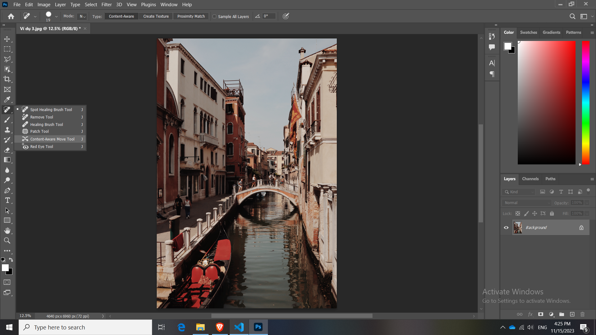

# Nhóm công cụ Healing

Phím tắt là: "J"

## Spot Healing Brush Tool: 

Chức năng của thằng này là lấy những nền xung quanh nó đắp vào vật thể mà mình bôi. Gần giống như xóa nhưng không phải xóa

Chỉ nên dùng tính năng này cho các chi tiết nhỏ nhỏ, đối với các vật thể lớn để che lắp nó đi sẽ bị lỏm chỏm nhìn không thật

**Chú ý:**

Trước khi bắt đầu sử dụng chức năng này thì hãy nhớ không được thao tác trực tiếp lên ảnh mà phải thêm 1 lớp layer rồi chọn Sample All Layers rồi thao tác trên Layer đó.

Remove Tool

Healing Brush Tool

Patch Tool

Content-Aware Move Tool

Red Eye Tool

## Tổng kết:

1. Spot Healing Brush Tool để xóa những chi tiết nhỏ trong một bức hình, nhỏ nhỏ thui không to quá, nếu to quá nó có thể nhìn không thật

2. Remove tool dùng công nghệ AI mới nhất để xóa hình ảnh và lắp đầy nó bằng các background xung quanh và đặc biệt là nhìn rất giống như thật (khuyên nên dùng).

3. Healing Brush Tool và Patch Tool dùng để chắp, vá phần hình ảnh của khu vực này sang khu vực khác (Tiện lợi cho việc Retouch).

Nhược điểm của thằng số 3 "Patch Tool" là phải sử dụng trực tiếp lên ảnh gốc. Cân nhắc khi sử dụng