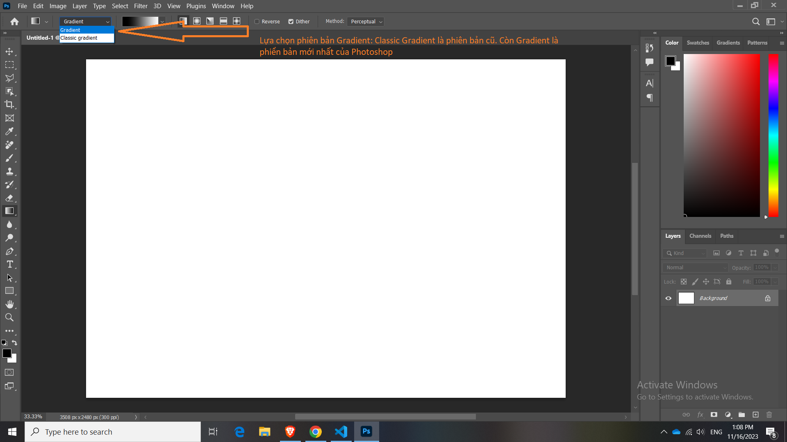
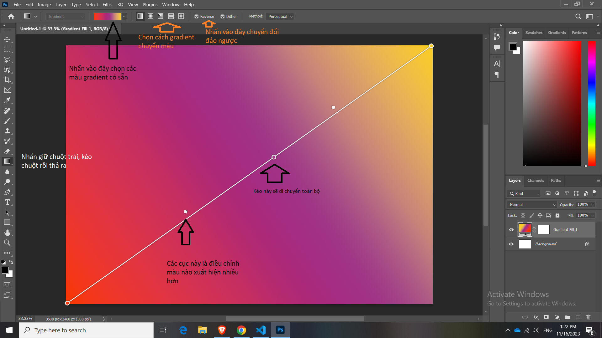
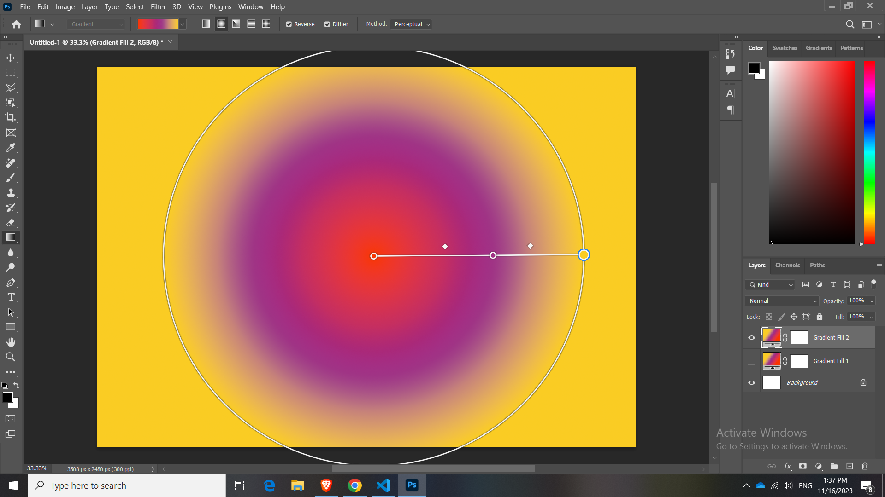

# Bài 23 Tìm hiểu công cụ Gradient

Gradient là hiệu ứng chuyển màu từ màu này sang màu khác

Và ít nhất là phải có 2 màu trở lên mới làm được Gradient

Chuyển màu A sang màu B

Để dùng công cụ Gradient thì mình có **phím tắt**: "G"

Trong bản photoshop hiện tại có 2 option:

- Classic Gradient: Công cụ Gradient cũ của các phiên bản PS trước
- Gradient: Công cụ Gradient mới được bản PS mới update

Hướng dẫn cơ bản về Gradient.

## Linear Gradient

Vẽ từ bên trái sang nếu nhấn kéo từ bên trái kéo qua, hoặc nhấn reverse để PS tự động đổi từ trái sang phải

Hoặc muốn kéo từ phải qua trái ngay từ ban đầu.

## Radial Gradient

RadialGradient nó sẽ tỏa ra hình tròn và đi từ tâm kéo ra

Người dùng có thể di chuyển tâm và đường kính của hình tròn

Nếu mà số màu lớn hơn 2 là 3 chẳng hạn, thì ta có thể loại bỏ bớt màu bằng cách kéo màu trên thành ngang dài dài ra thì màu đó sẽ biến mất.

Còn lại:

 Angle Gradient

 Reflected Gradient

 Diamond Gradient

Tự các bạn khám phá thêm. Hai cái trên kia là dùng nhiều nhất

**Học lại nha bài này hay**

