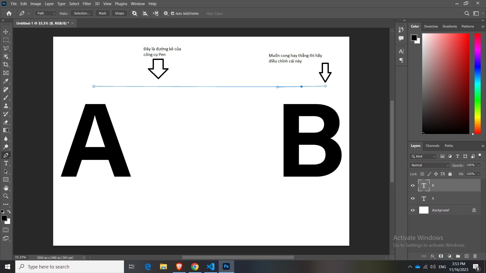
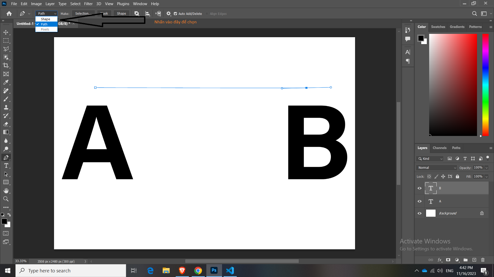
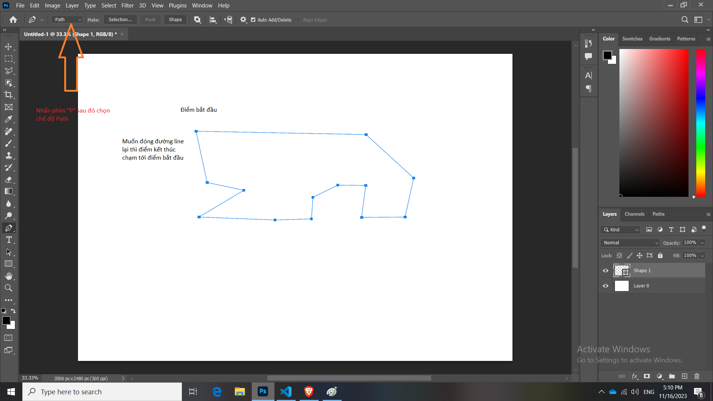
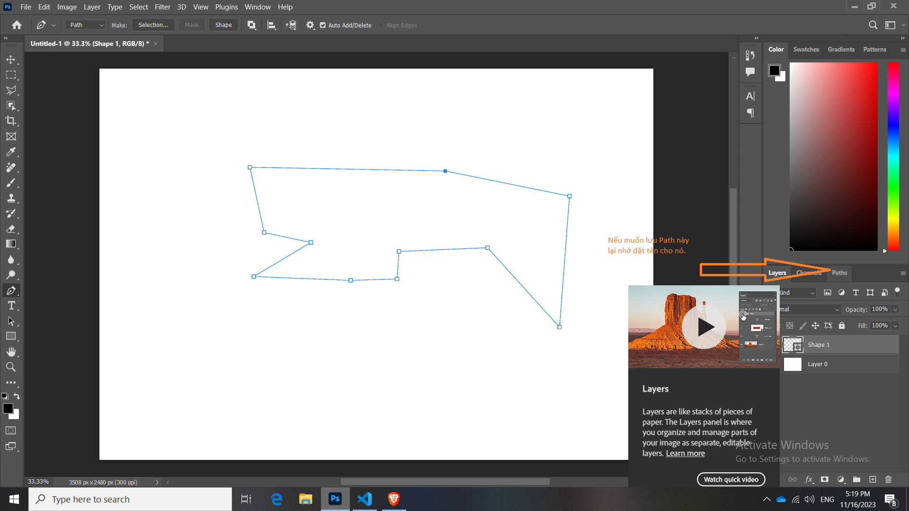
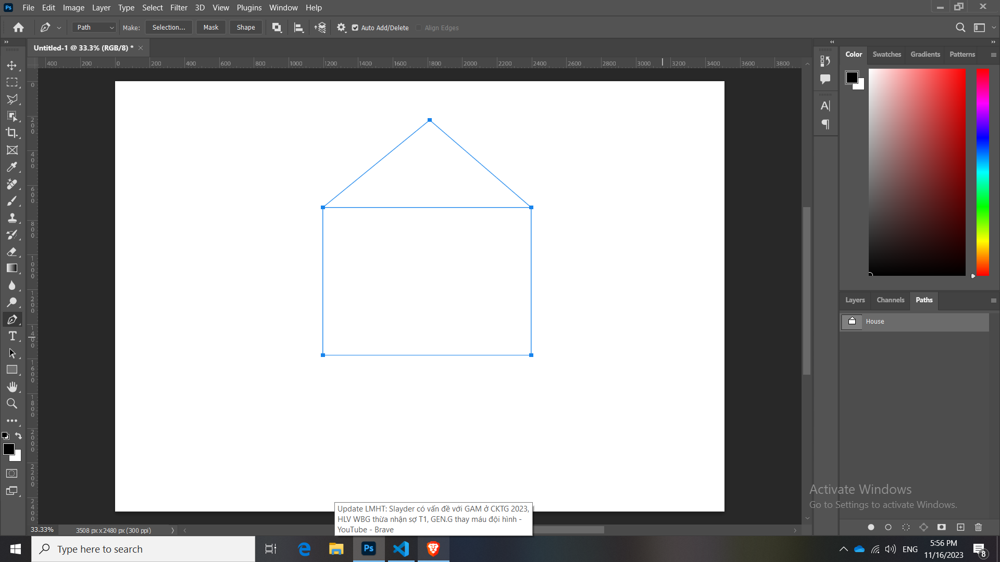

# Công cụ Pen tool

## Giới thiệu công cụ Pen

Công cụ Pen tool cực kỳ quan trọng, lúc nào cũng dùng tới. Tạo bất cứ thứ gì với công cụ pen. Công cụ pen này cũng được nhiều các hãng quảng cáo lớn sử dụng để cắt hình và tạo hình. Ví dụ: tạo vùng chọn cho sản phẩm, để mà đạt độ chính xác cao nhất thì công cụ Pen luôn luôn được ưu tiên các cộng chọn nhanh vùng chọn sẽ không được ưu tiên hay khuyến khích sử dụng. Tại vì dùng pen giúp tạo nên siêu mượt không có lõm chõm như các công cụ tạo nhanh vùng chọn

Phím tắt của Pen là: "P"

Muốn tạo 1 đường từ A sang B:

Tạo đường thẳng:

- Click tại điểm A, sau đó click tại điểm B (Đối với đường thẳng)

Tạo đường cong:

- Click tại điểm A, sau đó click chuột và giữ tại điểm B, và điều chỉnh độ cong tùy theo ý thích

**Lưu ý:** Đường thẳng này sẽ không bị Pixel late

Đường xanh xanh từ A sang B đó gọi là **Path**

Vậy đường Path là gì? Đường Path là đường dạng đồ họa vector mà ra. Cho nên khi zoom vào ta vẫn sẽ thấy đường xanh xanh này không thay đổi, không to lên hay nhỏ đi. Nó không có độ dày

**Tóm lại**: Đường Path là đường không có độ dày và có nên tảng đồ họa vector

Ngoài ra công cụ Pen ngoài việc tạo ra **Path** còn thạo ra được **Shape** nữa

sau khi chuyển sang chế độ shape

ta có thể vẽ được các hình khác nhau: Hình tam giác, ...

## Cách sử dụng công cụ Pen

Tạo đường thằng

Set trên thanh công cụ về thành Patch

Chấm điểm đầu, để đóng lại thì điểm đầu điểm cuối phải trùng nhau

Các điểm không phải là đầu và cuối, giống nhu các khớp nối gọi là "**Anchor point**". Các cái điểm này có thể di chuyển được, việc di chuyển được các cái điểm neo này. Để mà di chuyển được "Giữ Ctrl" + click vào điểm cần di chuyển, sau đó di chuyển (trong lúc di chuyển thì có thể bỏ Crtl được nha). Di chuyển đến nơi cần di chuyển thì thả ra

Và cái Path này nó nằm ở đây:

Muốn lưu lại thì hãy nhớ đặt tên cho nó

Đặt 2 thước dọc và 2 thước ngang

Nhấn chọn điểm bắt đầu và nhấn giữ shift và chọn điểm xiêng xiêng tiếp theo để được 45 độ

Nhấn chọn điểm thẳng được 90 độ và ngang là 0 độ

Done

Bây giờ muốn convert Path này thành 1 Shape thì sao

Path là rỗng ruột, Shape đặc ruột Hoặc hiểu theo ý nghĩa Shape là 1 dạng Path nhưng có màu ở bên trong, bình thường thì Path không có.

Bước 1: Chọn Path

Bước 2: Quay lại bảng layer, chọn Adjustment Layer, chọn solid Color. Nó sẽ tự động tạo ra 1 cái shape layer

**Chú ý:** biểu tượng shape layer khác với biểu tượng Convert to smart object

### Vẽ đường cong:

Ví dụ vẽ giọt nước

### Chú ý
biến 1 điểm thành corner: (Convert 1 anchor point thành 1 cái corner)

Giữ Alt + click vào điểm đó (xóa đi cái handler cầm để chỉnh)

### Chú ý
Để tạo lại thanh handler đó: Giữ alt + click vào điểm đó + kéo qua trái hoặc phải từ từ

## Ứng dụng của Pen

**Học lại nha bài này hay**

Mẹo: Mở tính năng cây thước.
- Bật tính năng cây thước: Ctrl + R
- xong mình chỉ cần nhấn giữ chuột trái lần vào cây thước và kéo nó tới vị trí cần đặt thước 
- Tất nhiên các cây thước này chỉ dùng để đo, khi in ra giấy thì các đường này sẽ không tồn tại. Nên yên tâm mà dùng

Mẹo: Vẽ đường Pen lúc nào cũng thẳng theo hướng 90, 45 và 0
- Chấm 1 điểm làm chuẩn
- Sau đó giữ phím shift
- sau đó nhấn 1 điểm còn lại, lúc đó nó sẽ kẽ 1 đường thật thẳng

